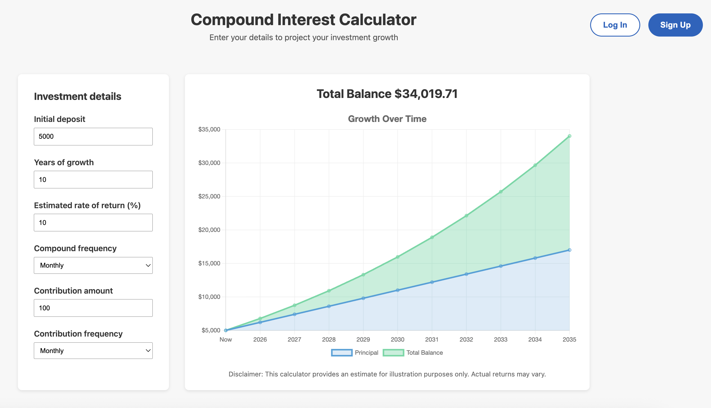
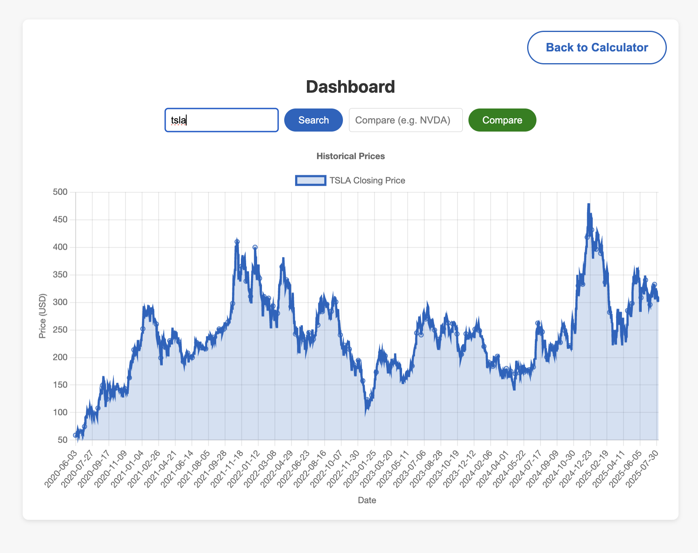
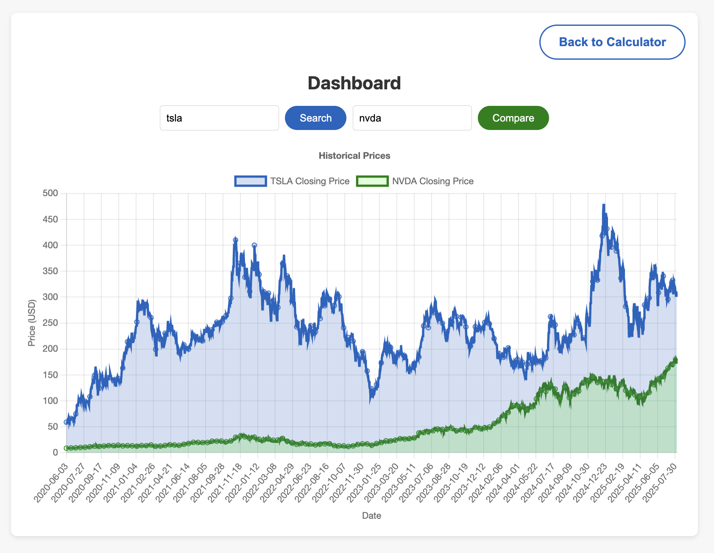

# 📈 Compound-Interest Calculator & Finance Dashboard

Full-stack React + TypeScript web app for projecting investment growth and visualising historical stock prices.

**Live demo:** https://personalfinancecalculator.netlify.app/

---

## Features
- **Compound-interest calculator** – customise deposit, rate, term, contributions; real-time Chart.js plot splits principal vs. interest.
- **Stock dashboard** – 5-year closing-price chart; overlay a second ticker for comparisons; pan/zoom & tooltips.
- **Email auth** – Firebase Authentication for sign-up, log-in and session handling.
- **Responsive UI** – Tailwind CSS, optimised for phone, tablet and desktop.

---

## Screenshots
| Calculator | Dashboard | Compare View | Sign-Up |
|------------|-----------|--------------|---------|
|  |  |  |  |

---

## 🚀 Getting started

```bash
git clone https://github.com/harryalloyd/compound_interest_calculator.git
cd compound_interest_calculator


## Environment variables
Create `.env` in the repo root and get an api key from [TwelveData API](https://twelvedata.com/?ref=yH5SV2P&utm_campaign=branded_search&utm_medium=cpc&utm_source=google&gad_source=1&gad_campaignid=22524074813&gbraid=0AAAAAo2o-AEAMUMtZfaUr1AsLBpwnt20v&gclid=Cj0KCQjw18bEBhCBARIsAKuAFEYpbhysxfPwuGbRg1pC8GpYE1QuTFSoLR1sWT-n0fcnQlInzUG-Y5caAt5tEALw_wcB) and [Firebase](https://firebase.google.com/?gclsrc=aw.ds&gad_source=1&gad_campaignid=12211052842&gbraid=0AAAAADpUDOjnP5Y5LaVe5KXrvEpP1tkcG&gclid=Cj0KCQjw18bEBhCBARIsAKuAFEbjp1c_tAQ59xMc8cMvW_KxlJ8Aa2DynWQPWkB3jjCEuqXUWcgvAs4aAqdrEALw_wcB)
VITE_FIREBASE_API_KEY=
VITE_FIREBASE_AUTH_DOMAIN=
VITE_FIREBASE_PROJECT_ID=
VITE_FIREBASE_STORAGE_BUCKET=
VITE_FIREBASE_MESSAGING_SENDER_ID=
VITE_FIREBASE_APP_ID=
VITE_FIREBASE_MEASUREMENT_ID=
VITE_TWELVE_DATA_API_KEY=
```
